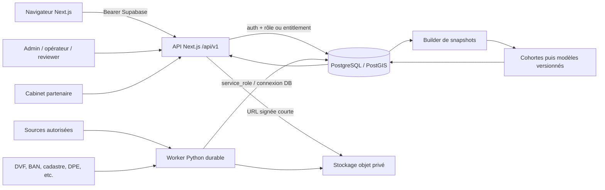

# Outcome Graph — architecture cible

_Architecture normative issue de `CODEX_OUTCOME_GRAPH_SPEC_V2.md`. Ce document décrit la destination; il ne certifie pas que chaque composant est déjà livré. Voir [`IMPLEMENTATION_STATUS.md`](../../IMPLEMENTATION_STATUS.md) pour l’écart réel._

## Objectif d’architecture

Outcome Graph est un registre relationnel national des trajectoires de vente judiciaire :

```text
Dossier → Lot → Audience → Événement/Résultat → Preuve/Revue
                                      ↘ Snapshot → Prédiction
```

PostgreSQL reste l’unique source de vérité. « Graph » désigne les relations métier, pas une base graphe. Le produit commercial est une projection premium du registre; il ne doit jamais devenir la seule copie d’un résultat, d’une preuve ou d’une prédiction.

## Principes structurants

1. **Historique conservé.** Événements, preuves, revues, versions de résultat, snapshots, prédictions et audits sont append-only.
2. **Temps connu.** `event_at`, `published_at`, `captured_at`, `observed_at`, `feature_cutoff_at` et `generated_at` restent distincts.
3. **Inconnu explicite.** Une absence de donnée ne signifie jamais annulation, report, no-bid ou absence de surenchère.
4. **Donnée avant audience.** Une feature prédictive est admissible uniquement si sa publication et sa capture précèdent le cutoff.
5. **Preuve avant modèle.** Seuls les résultats A/B, revus et sans anomalie bloquante alimentent l’entraînement.
6. **Premium côté serveur.** L’UI peut masquer le produit, mais l’autorisation est décidée par l’API et la base.
7. **Source autorisée.** Toute collecte web automatisée exige `allowed_automated`; un flux contractuel distinct exige `partner_only` et le canal partenaire prévu.
8. **Pas de profilage individuel judiciaire.** Aucune identité de magistrat ou de greffe dans les features, exports ou classements.

## Vue d’ensemble



## Déploiement logique

### Web et API

- Next.js App Router, React et TypeScript strict restent le point d’entrée produit.
- Les routes `/api/v1` portent les contrats JSON, l’authentification, les décisions d’autorisation, l’idempotence et les validations Zod.
- Les lectures client utilisent des projections dédiées; elles ne donnent pas un accès général aux artefacts bruts ou aux tables d’administration.
- Vercel peut héberger le web et les routes courtes. Les calculs lourds et les collectes ne doivent pas dépendre d’une requête web longue.

### Base et stockage

- Supabase PostgreSQL avec PostGIS contient les entités métier, les versions, les files et les journaux.
- RLS est activée sur toute table exposée à `anon` ou `authenticated`; les tables worker-only ne reçoivent aucun grant navigateur.
- Les preuves et artefacts sont dans des buckets privés distincts, sous des noms UUID, avec hash et type MIME vérifié.
- Les téléchargements passent par des URL signées à courte durée de vie.

### Worker

- Le worker Python typé exécute `discover → fetch → store_raw → extract → normalize → match → validate → review → publish → enrich → snapshot → analyze`.
- `ingestion_jobs` est consommée transactionnellement avec `FOR UPDATE SKIP LOCKED`, heartbeat, backoff et dead-letter.
- Chaque producteur lit sa politique dans `data_sources`; `allowed_automated` autorise le connecteur automatisé, `partner_only` seulement le canal partenaire, et l’absence d’autorisation vaut refus.
- Un job est idempotent sur `source_id + external_record_id + content_hash + connector_version`.
- GitHub Actions peut rester l’orchestrateur transitoire, mais la cible d’exploitation est un conteneur long-running pour les jobs à faible latence.

### Outillage du dépôt

Le cahier des charges vise un monorepo `apps/*` et `packages/*`, `pnpm` pour JavaScript et `uv` pour Python. Le dépôt existant utilise npm à la racine et pip dans `services/data-pipeline`. La migration cible doit être progressive :

1. stabiliser les contrats et la tranche verticale dans la structure actuelle;
2. créer les packages partagés seulement lorsqu’un second consommateur réel existe;
3. migrer npm → pnpm et pip → uv dans une modification dédiée;
4. préserver les versions verrouillées, les commandes CI et la reproductibilité avant de retirer les anciens lockfiles.

La structure de dossiers n’est pas une condition préalable à l’intégrité du registre; les invariants de données et de sécurité le sont.

## Modèle relationnel cible

### Identité et référence

- `organizations`, `organization_members`, `user_profiles` : organisations, rôles et appartenances.
- `courts`, `law_firms`, `addresses`, `parcels`, `buildings` : référentiels stables et enrichissement territorial.

### Provenance et ingestion

- `data_sources` : identité, licence, politique et état du connecteur.
- `source_fetches` : requête/réponse et horodatages de collecte.
- `raw_artifacts` : contenu brut adressé par hash et emplacement privé.
- `artifact_extractions` : résultat d’extraction versionné et reproductible.
- `ingestion_jobs` : file durable et idempotente.

### Registre judiciaire

- `auction_cases` : une procédure identifiable devant un tribunal.
- `auction_lots` : un lot réellement offert, indépendant de sa source d’annonce.
- `auction_lot_parcels`, `auction_lot_buildings` : associations plusieurs-à-plusieurs.
- `auction_rounds` : chaque tentative d’audience, liée à la précédente si report, surenchère ou réitération.
- `auction_events` : transitions et corrections append-only.
- `auction_outcomes` : versions successives du résultat d’un round.
- `auction_outcome_evidence` : claims soutenus, grade et niveau de rapprochement.
- `evidence_reviews` : décisions humaines append-only et indépendantes.
- `auction_participation_observations` : nombre d’enchérisseurs sous forme de bucket et méthode d’observation.

### Features, analytics et modèles

- `feature_definitions` : nom, type, sens, version et règle anti-fuite de chaque feature.
- `auction_feature_snapshots` : features figées à T-30, T-14, T-7, T-1 et T-2h.
- `cohort_definitions`, `cohort_statistics` : agrégations versionnées et fallback hiérarchique.
- `model_versions` : artefacts, métriques, approbation et statut de chaque modèle Outcome; la provenance d’approbation est figée après la sortie de `draft`.
- `auction_predictions` : probabilités et quantiles immuables reliés au round, snapshot, cohorte et modèle, avec une taille d’échantillon identique à celle de la cohorte persistée.
- `data_quality_issues`, `audit_log` : conflits, anomalies et actions sensibles.

Le dictionnaire normatif de ces tables est dans [`docs/data-dictionary.md`](../data-dictionary.md).

## Machine d’état et écriture

`auction_rounds.current_status` est une projection pratique. La preuve historique d’une transition réside dans `auction_events`.

Une commande de transition doit :

1. verrouiller le round courant;
2. vérifier la transition et ses préconditions;
3. insérer un événement immuable;
4. mettre à jour la projection `current_status` dans la même transaction;
5. créer un nouveau round si la trajectoire continue à une autre date;
6. journaliser l’acteur et le `request_id`.

Une correction ne modifie pas l’événement fautif. Elle ajoute un événement avec `supersedes_event_id` et `correction_reason`. De même, un résultat corrigé crée une nouvelle version avec `supersedes_outcome_id` et ne réutilise jamais le même numéro de version. La version courante et sa fin de validité sont dérivées de la chaîne de supersession; la ligne précédente n’est pas mise à jour.

## Autorisation et offre premium

### Rôles métier

| Rôle | Portée cible |
|---|---|
| Administrateur plateforme | Sources, organisations, audits et approbation de modèles |
| Opérateur de données | Dossiers, lots, rounds, rapprochement et soumission de résultats |
| Reviewer | Preuves, décision champ par champ et grades A/B/C |
| Cabinet partenaire | Uniquement les dossiers rattachés à son organisation |
| Contributeur | Soumission de preuve classée C par défaut |
| Analyste | Données pseudonymisées et exports autorisés |
| Client ImmoJudis | Projection de prédiction et scénario de plafond personnel |

Les rôles sont portés par les memberships, pas par des chaînes envoyées par le client. Un reviewer ne peut pas produire deux revues indépendantes de la même preuve.

### Accès client Analyse

La restitution client utilise la fonctionnalité `property.outcomeGraph` de la matrice existante :

```text
Découverte → locked
Analyse    → included
```

Chaque route de restitution exécute :

```text
validation du Bearer token
→ résolution admin / premium manuel / abonnement Analyse actif
→ assertFeatureEntitlement(property.outcomeGraph)
→ lecture de la projection autorisée
```

Si une route utilise `service_role`, le contrôle d’entitlement doit précéder toute requête, car cette clé contourne la RLS. La tranche actuelle n’accorde aucun accès navigateur aux 16 tables internes et sert la projection uniquement par l’API. Si une lecture directe est introduite ultérieurement, elle passe par une vue minimale `security_invoker` et une policy restrictive fondée sur `public.has_analysis_access()`, jamais par un grant large sur les tables brutes.

Les endpoints opérateur, reviewer, cabinet et analyste reposent sur leurs propres rôles et scopes; être premium ne donne aucun droit d’écriture dans le registre.

## Contrats API

### Conventions

- préfixe `/api/v1`;
- JSON et dates ISO 8601 UTC;
- pagination par curseur;
- `request_id` dans réponse et logs;
- `Idempotency-Key` obligatoire pour les commandes répétables;
- montants Outcome Graph en centimes entiers sûrs (`15100000` pour 151 000 €), jamais en float;
- probabilités entre 0 et 1, quantiles monotones;
- `unknown` explicite plutôt qu’un champ omis lorsqu’il change le sens métier.

### Surfaces principales

| Domaine | Endpoints cibles |
|---|---|
| Dossiers | `GET/POST /cases`, `GET/PATCH /cases/{id}` |
| Lots | `POST /cases/{id}/lots`, `GET/PATCH /lots/{id}`, `GET /lots/{id}/timeline` |
| Audiences | `POST /lots/{id}/rounds`, `GET /rounds/{id}`, `POST /rounds/{id}/transition`, `GET /rounds/{id}/events` |
| Résultats et preuves | `POST /rounds/{id}/outcomes`, `POST /outcomes/{id}/evidence`, `POST /evidence/{id}/reviews` |
| Snapshots | `POST/GET /rounds/{id}/snapshots`, `GET /snapshots/{id}` |
| Analytics | `GET /analytics/courts/{id}`, `/lots/{id}/comparables`, `/coverage` |
| Prédictions | `POST /rounds/{id}/predictions`, `GET /rounds/{id}/predictions/latest`, `GET /predictions/{id}` |
| Cabinet | `GET /partner/rounds/upcoming`, `POST /partner/rounds/{id}/submit-result` |

Le plafond personnel est un paramètre privé. Le service peut calculer `P(prix_final ≤ plafond | adjudication)` et `P(adjudication ET prix_final ≤ plafond)`, mais ne doit ni republier le plafond ni l’injecter dans les features partagées.

## Snapshots et prévention de fuite

Un snapshot est admissible si, pour chaque source :

```text
published_at <= feature_cutoff_at
ET captured_at <= feature_cutoff_at
```

Le builder :

- lit des versions temporelles, jamais la page actuelle comme substitut silencieux;
- conserve un manifeste des sources, versions et dates;
- calcule `source_manifest_hash` et `snapshot_hash`;
- enregistre la version du builder, du schéma de features et de l’estimation de marché;
- refuse les champs résultat et les textes révélateurs tels que « adjugé à »;
- marque toute reconstruction postérieure `retrospective = true` et `training_eligible = false` jusqu’à preuve historique.

Après le premier snapshot, les entrées prédictives du round sont figées : une correction, un report ou une nouvelle programmation crée un nouveau round relié au précédent. Les validateurs de snapshot et de prédiction verrouillent le round avec `FOR SHARE` pendant leurs contrôles afin d’éviter une modification concurrente de ces entrées.

## Analytics et modèles

L’ordre de livraison est obligatoire :

1. statistiques nationales et cohortes lissées;
2. quantiles et fonctions de plafond;
3. modèles simples après 300 résultats éligibles;
4. modèles plus complexes seulement après 1 000 résultats vérifiés;
5. shadow mode prospectif avant publication commerciale.

Le fallback de cohorte descend de tribunal + procédure + type + occupation + décote vers le national. `n < 10` produit un refus de statistique autonome, pas une précision artificielle.

Une prédiction publiée indique au minimum : date, horizon, conditions, modèle, snapshot, échantillon, confiance, facteurs principaux et motif de refus éventuel. La formulation « probabilité de gagner » est interdite.

## Sécurité, confidentialité et audit

- RLS testée pour client, cabinet, reviewer, analyste, administrateur et service role.
- Isolation stricte inter-cabinets et absence d’IDOR sur tous les UUID.
- Artefacts bruts et preuves non indexables, buckets privés et upload contrôlé.
- Protection SSRF des connecteurs : localhost, IP privées, metadata cloud, redirections internes et tailles excessives refusés.
- Données de débiteurs, occupants, coordonnées privées et magistrats exclues des tables analytiques.
- `audit_log` conserve les commandes sensibles et leurs acteurs; les logs techniques excluent contenu de preuve, plafond et secrets.

## Observabilité et exploitation

Chaque log structuré contient `timestamp`, `level`, `service`, `request_id`, `job_id`, `source_id`, `entity_id`, `operation`, `duration`, `status` et `error_code` lorsqu’ils existent.

Les tableaux de bord séparent :

- couverture J+1/J+10/J+45, grades A/B/C, conflits, délai de revue et snapshots manquants;
- profondeur et âge de file, retries, dead-letter, latence API, 5xx et durée d’import;
- délai du tribunal, de publication de la source, de collecte et de validation.

Les alertes portent sur une dégradation mesurable et possèdent un runbook; elles ne déduisent pas une annulation d’un simple silence de source.

## Stratégie de mise en production

1. migrations additives et tests pgTAP;
2. écriture du registre derrière feature flag;
3. backfill marqué non vérifié;
4. double écriture et contrôle de parité;
5. revue des premiers résultats et snapshots prospectifs;
6. prévisualisation interne en lecture seule derrière feature flag;
7. shadow mode prospectif et scoring temporel;
8. activation premium progressive seulement après seuils de données et de modèle validés;
9. dépréciation du modèle aplati uniquement après restauration testée.

En cas d’incident, désactiver la restitution et les nouveaux producteurs. Ne jamais rollbacker en supprimant l’historique append-only.
