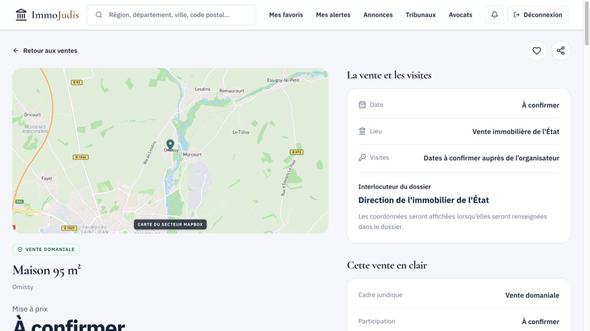

# Fiches de vente : état des lieux et trois templates proposés

**Date :** 23 septembre 2026
**Périmètre :** fiches `/sales/[id]` en production, vues sur ordinateur avec un compte ayant accès à l’offre Analyse ; code des aperçus publics et du compte Découverte. Aucune modification du produit ni publication.

## Parcours observé

1. **Vente au tribunal — fonctionnement partiellement adapté.** La fiche met en avant l’audience, le tribunal et les visites. L’historique des adjudications est présent et contextualisé. Le contact extrait de la source est toutefois difficile à lire ; le rapprochement entre Noth (Creuse) et « TJ Créteil » appelle une vérification des données avant d’utiliser ce tribunal comme contexte statistique. [Fiche observée](https://immojudis.com/sales/64bf9b2f-4348-45cf-af81-4e9e16229769).

   

2. **Vente notariale — informations utiles, priorité confuse.** La fenêtre du 22 au 23 octobre est présentée comme un « début » et une « fin de séance », tandis que le mode de participation reste à confirmer. « Mélina » apparaît à la fois comme lieu et interlocuteur. Le cahier des charges, l’inscription et la consignation devraient guider la page avant l’analyse financière. [Fiche observée](https://immojudis.com/sales/fbda4745-485c-49af-9f2f-de22dc0715cd).

   

3. **Vente domaniale avec prix — données de procédure insuffisamment visibles.** Le prix est connu, mais la date et les visites restent inconnues ; la page affiche pourtant la même composition que les autres ventes. Les documents et la source officielle devraient être les premiers repères. [Fiche observée](https://immojudis.com/sales/ebf94a38-8ba3-4b8d-a331-2c339977c351).

   

4. **Vente domaniale sans prix — composition peu adaptée.** Prix, date et participation sont à confirmer, mais l’emplacement principal reste consacré à la « mise à prix ». La page gagnerait à expliquer l’état du dossier et la prochaine action utile. [Fiche observée](https://immojudis.com/sales/82bf6b64-b60f-47f5-9349-999679fd6034).

   

Le catalogue public affichait, lors de l’observation, **2 045 ventes au tribunal, 234 notariales et 59 domaniales**. Ces nombres évoluent. Sur les 24 premières annonces domaniales affichées, 18 n’avaient pas de prix publié et 23 n’avaient pas de date publiée ; il s’agit d’un échantillon de page, pas d’une mesure de tout le catalogue.

## Ce qui existe déjà et ce qui pose problème

- Une seule route et une seule composition servent les trois types pour Découverte et Analyse ; l’aperçu public partage lui aussi une structure unique. Les badges, certains libellés, les démarches et le budget changent déjà selon `sale_venue_type`.
- **Point positif :** l’historique des tribunaux est déjà réservé aux ventes classées « tribunal » dans les vues publiques, Découverte et Analyse. La séparation est donc à renforcer dans la hiérarchie et les règles de présentation, sans recréer ce garde-fou.
- L’aperçu public promet une « estimation de votre mise plafond » pour tous les types ; l’en-tête Analyse et le bloc Découverte répètent cette promesse. La fiche notariale ou domaniale explique ensuite que le modèle automatique est propre aux ventes au tribunal. Cela crée une attente déçue.
- « Cahier des conditions de vente » est affiché dans les risques des trois types. Pour les ventes notariales, le document mis en avant devrait être le cahier des charges ; pour les domaniales, les conditions de vente ou le cahier des clauses particulières de l’annonce précise.
- « Vente domaniale » désigne l’organisateur, mais pas le **mode de cession**. Les cessions immobilières de l’État peuvent prendre la forme d’un appel d’offres, d’une adjudication ou d’une cession amiable. Un template domanial ne doit donc pas supposer systématiquement une enchère.
- **Lisibilité à vérifier :** les captures 1 à 3 montrent un badge de procédure et plusieurs notes de contact en petits caractères. Leur contraste, leur lecture à fort zoom et l’accès clavier demandent un contrôle dédié ; les captures seules ne permettent pas de conclure à une non-conformité.

## Templates proposés

| Type | Premier écran et information prioritaire | Suite de page | Action principale |
| --- | --- | --- | --- |
| **Tribunal : préparer l’audience** | Bien, mise à prix, date et lieu d’audience, visite ; état de vérification du tribunal. | Cahier des conditions de vente, occupation et risques, avocat compétent, consignation et frais ; analyse de mise plafond ; historique du tribunal seulement si le rattachement est fiable, avec échantillon et limites. | « Consulter le dossier » puis « Préparer mon enchère avec un avocat ». |
| **Notariale : comprendre la séance** | Bien, office organisateur, format sur place/en ligne, ouverture et clôture s’il s’agit d’une fenêtre d’offres, mise à prix si publiée. | Cahier des charges, inscription, consignation, frais et financement propres à la vente ; visites, contact de l’office ; marché local lorsque les références sont solides. | « Voir les conditions de la vente » ou « Contacter l’office ». |
| **Domaniale : qualifier la cession** | Bien, service vendeur, **mode de cession**, échéance ou état de publication ; prix seulement s’il est publié. | Annonce et documents officiels, conditions d’éligibilité et de dépôt, visite, frais propres à la vente ; budget et marché seulement si les données le permettent. | « Consulter l’annonce officielle » puis « Vérifier les modalités de candidature ». |

Les trois templates gardent le même socle technique : identité du bien, photos ou carte correctement qualifiée, localisation, occupation, documents, sources, favoris et accès selon l’offre. Les blocs, leur ordre, leur vocabulaire et leurs actions sont propres à la procédure. Un type inconnu ou contradictoire utilise une fiche neutre avec les faits confirmés et les points à vérifier.

## Conditions avant publication

1. Définir et vérifier le mode de cession domanial séparément du type d’organisateur ; ne pas inventer de prix, de date ou de règle de participation.
2. Lier les statistiques judiciaires à une vente au tribunal **et** à un tribunal correctement rattaché ; corriger ou retenir les fiches suspectes.
3. Supprimer toute promesse de « mise plafond » des parcours notarial et domanial, y compris de l’aperçu public et de Découverte.
4. Vérifier les libellés d’horaires, les organismes et contacts extraits, ainsi que les documents recommandés pour chaque type.
5. Contrôler les trois parcours sur ordinateur et mobile, en aperçu public, Découverte et Analyse, puis l’accès clavier. Ce passage n’a pas été effectué pendant le présent état des lieux.

**Références de procédure :** [Notaires de France, ventes aux enchères](https://www.immobilier.notaires.fr/fr/articles/conseils-et-actualites/achat-vente/comment-organiser-vendre-ou-acheter-aux-encheres) ; [Ministère de l’Économie, ventes publiques et cessions immobilières de l’État](https://www.economie.gouv.fr/particuliers/mes-droits-conso/bien-consommer/ventes-aux-encheres-publiques-vous-pouvez-y-participer?language=en-gb).
